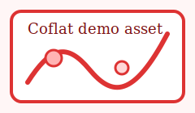

This is the canonical single-page Coflat showcase. It is meant to exercise the editor's main document surfaces in one place: frontmatter, inline rendering, display math, semantic blocks, figures, tables, embeds, code, references, citations, footnotes, includes, and structure-edit behavior.

# Frontmatter and Structure Editing

Use this file to check the stable-shell behavior itself:

- ordinary navigation should keep block topology stable
- clicking user-facing labels like theorem/proof/figure titles should open only the relevant structure field
- `Escape` should close explicit structure editing cleanly
- the red shell overlay should follow the real rendered surface, not hidden source lines

# Unnumbered Heading {-}

This heading has `{-}` — it should NOT have a section number.

# Numbered Heading

This SHOULD have section number "1".

## Unnumbered Subsection {.unnumbered}

Uses `{.unnumbered}` — also no number.

## Numbered Subsection

Should be "1.1".

# A Very Long Heading With **Bold**, `code`, $x^2$, a [link](https://example.com), and [@cormen2009] That Should Stay Readable in Breadcrumbs and Outline

This heading exists to verify:

- document-inline rendering inside the document body
- ui-chrome-inline degradation in breadcrumbs / outline / other chrome surfaces
- full breadcrumb text (no truncation)

# Inline Rendering

**Bold text**, *italic text*, ~~strikethrough~~, ==highlight==, `inline code`.

Inline math: $e^{i\pi} + 1 = 0$, $\sum_{k=1}^n k = \frac{n(n+1)}{2}$.

Mixed delimiters: $x^2$ and \(y^2\) in the same line.

# Display Math

Standard:

$$
\int_0^\infty e^{-x^2} dx = \frac{\sqrt{\pi}}{2}
$$

Backslash:

\[
\sum_{k=0}^n \binom{n}{k} = 2^n
\]

Display math without blank line before:
$$
a^2 + b^2 = c^2
$$

# Labeled Display Math and Equation References

Plain labeled `$$` block:

$$
\int_0^\infty e^{-x^2} dx = \frac{\sqrt{\pi}}{2}
$$ {#eq:gaussian}

Labeled `\[\]` block:

\[
\sum_{k=0}^n \binom{n}{k} = 2^n
\] {#eq:binomial}

Equation references should work in both bracketed and narrative forms:

- Bracketed: [@eq:gaussian], [@eq:binomial]
- Narrative: @eq:gaussian and @eq:binomial
- Clustered: [@eq:gaussian; @eq:binomial]

# Block Hover Preview Coverage

:::: {#thm:hover-preview .theorem} Hover Preview Stress Test
This referenced block exists to test hover previews for paragraphs, lists, blockquotes, citations, links, inline math, and display math.

It contains **bold**, `code`, [a link](https://example.com), [@cormen2009], and inline math $x^2 + y^2$ in one paragraph.

$$
\sum_{i=1}^n i = \frac{n(n+1)}{2}
$$

- First list item with math $O(n \log n)$
- Second list item with a citation [@cormen2009]
- Third list item with an equation reference [@eq:gaussian]

::: {.blockquote}
Blockquote inside the referenced block with $\alpha + \beta$.
:::
::::

Hover this block reference: [@thm:hover-preview].

Hover the cluster items separately: [@thm:hover-preview; @thm:fundamental; @eq:gaussian].

:::: {.theorem} Gap Test
Outer content before inner

::: {.blockquote}
Inner quote with $\alpha$
:::

Outer content after inner closes with $\beta$
::::

# Math in Lists

1. First item with inline math $O(n \log n)$
2. Display math in list:
   $$
   T(n) = 2T(n/2) + O(n)
   $$
3. Backslash display math in list:
   \[
   f(x) = \sum_{i=0}^n a_i x^i
   \]
4. Simple text item

- Bullet with math: $\R$, $\N$, $\Z$

# Math in Fenced Divs

::: {#thm:fundamental .theorem} Fundamental Theorem
For all $n \in \N$:
$$
\sum_{k=1}^n k^2 = \frac{n(n+1)(2n+1)}{6}
$$
:::

::: {.proof}
By induction. Base case $n=1$: $1 = \frac{1 \cdot 2 \cdot 3}{6}$.
:::

:::: {.theorem #thm:nested} Outer shell
Outer shell content should stay rendered while an inner structure target is active.

::: {.proof #prf:nested}
Click the `Proof` label to edit only the opener, not the whole shell.
:::

Outer shell content after the inner proof should remain inside the outer shell.
::::

::: {#prop:tu .proposition}
Properties:

1. $A^T \in TU$
2. Display math in fenced div list:
   \[
   \begin{bmatrix} 0 \\ A_1 \\ A_2 \end{bmatrix} \in TU
   \]
3. Next item
:::

# Tables

| Algorithm | Time | Space |
|-----------|------|-------|
| Quicksort | $O(n \log n)$ | $O(\log n)$ |
| Mergesort | $O(n \log n)$ | $O(n)$ |

Rich table for edit/display parity and stale-widget tests:

| Case | Content | What to test |
|------|---------|--------------|
| emphasis + math | **Bold** and $x^2$ | rendered/edit visual parity |
| code + link | `inline code` and [link](https://example.com) | styling parity while editing |
| citation + highlight | [@cormen2009] and ==highlight== | source/render transitions |
| plain editable text | Edit this cell, leave it, and click back in. | stale widget regression |

# Tasks

- [x] Inline rendering surfaces are unified
- [x] Explicit structure editing is field-scoped
- [x] Stable shell overlay tracks the rendered surface
- [ ] Add even more browser-level regression scenarios

# Code Blocks

```haskell
fibonacci :: Int -> Int
fibonacci 0 = 0
fibonacci 1 = 1
fibonacci n = fibonacci (n-1) + fibonacci (n-2)
```

# Code Block Click Mapping

Click the visual center of these rendered lines in rich mode and make sure the cursor lands on the matching line rather than drifting downward.

```ts
const clickMappingLines = [
  "line 1",
  "line 2",
  "line 3",
  "line 4",
  "line 5",
  "line 6",
  "line 7",
  "line 8",
];

for (const line of clickMappingLines) {
  console.log(line);
}
```

# Gist Embed

::: {.gist}
https://gist.github.com/chaoxu/6094392
:::

# YouTube Embed

::: {.youtube}
https://www.youtube.com/watch?v=dQw4w9WgXcQ
:::

# Blockquote with Math

::: Blockquote
For any $\epsilon > 0$, there exists $\delta > 0$ such that:
$$
|x - a| < \delta \implies |f(x) - f(a)| < \epsilon
$$
:::

# Links and Images

[Link text](https://example.com) should render as underlined text, reveal source on click.

 should render as inline image without relying on a remote placeholder.

# Bold in Fenced-Div Titles

::: {.theorem} **Main Result**
This theorem title should render "Main Result" in bold.
:::

::: {.problem title="**3SUM**"}
This problem title uses the `title=` attribute and should render "3SUM" in bold.
:::

# Rich Block Titles

::: {.remark} Title with [a link](https://example.com), [@cormen2009], `code`, and $x^2$
This block title should stay rich inside the document surface.
:::

# Footnotes

This has a footnote[^1] and a richer footnote[^2].

[^1]: This is the footnote content with math $x^2 + y^2 = r^2$.
[^2]: This footnote has **bold**, `code`, a [link](https://example.com), a citation [@cormen2009], and math $\alpha^2 + \beta^2 = \gamma^2$.

# Cross-References and Citations

See [@cormen2009] for details.

By [@thm:fundamental], the sum formula holds. See also [@prop:tu].

Narrative block reference: @thm:fundamental.

Reference cluster: [@thm:fundamental; @prop:tu; @eq:gaussian].

# Includes

The included block below should splice content in without exposing raw include fences during ordinary navigation.

::: {.include}
showcase/include-section.md
:::

# Search Rich-Mode Coverage

Search for `SearchNeedle` and `@cormen2009`.

Plain prose SearchNeedle should highlight.

Inline math SearchNeedle: $SearchNeedle^2 + 1$.

Display math SearchNeedle:

$$
\text{SearchNeedle} = x + y
$$

::: {.definition} SearchNeedle Block Title
This block body also contains SearchNeedle and [@cormen2009].
:::

| Surface | Token |
|---------|-------|
| table cell | SearchNeedle |
| citation source | @cormen2009 |

Another SearchNeedle footnote[^search].

[^search]: SearchNeedle inside footnote tooltip and inline rendering.

# Manual Regression Checklist

Use this file to verify the split issues from #396 through #410.

- #396: hovering the labeled display math above should preview only the equation body, not the trailing `{#eq:...}` label syntax.
- #397: in clustered references, hovering one rendered item should preview only that item; hovering separators should do nothing.
- #398: when editing a raw reference token, the whole token should look like source rather than plain prose.
- #399: hovering `[@thm:hover-preview]` should render paragraph content, display math, list items, and the blockquote in the preview.
- #400: editing the long rich heading above should keep local inline editing behavior instead of reverting the whole heading to raw source.
- #401: the `title="**3SUM**"` problem block should render the title the same way inline block titles render.
- #402: with sidenotes collapsed, footnote references and bodies should still have a rendered presentation instead of exposing raw markdown.
- #403: rendered list markers should inherit ambient typography instead of staying monospace.
- #404: edit a table cell, leave it, and click back in; the rendered table should reflect current document state rather than stale cached content.
- #406: the rich table above should look as visually aligned as reasonably possible between display mode and active edit mode.
- #408: clicking lines in the code block click-mapping fixture should not drift to later lines in rich mode.
- #409 / #410: file-tree persistence and root-layout checks now belong to private fixture coverage, not this public showcase page.

# Figures, Tables, and Local Media

These blocks cover newer caption-below behavior and local PDF image rendering.

::: {#fig:pdf-local .figure} Local PDF figure with math $x^2 + y^2 = z^2$

:::

::: {#tbl:feature-matrix .table} Feature coverage matrix
| Surface | Example | What to verify |
|---------|---------|----------------|
| figure block | [@fig:pdf-local] | caption stays below the media |
| theorem block | [@thm:fundamental] | numbered block cross-reference |
| citation | [@cormen2009] | CSL-formatted citation rendering |
| inline math | $x^2 + y^2 = z^2$ | KaTeX inside table cells |
| inline code | `showcase/generated-figure.pdf` | monospace styling inside table cells |
:::

Cross-references: see [@fig:pdf-local] and [@tbl:feature-matrix].

- #506: the figure and table blocks above should render with "Figure 1." and "Table 1." labels on the LAST body line, not the opening fence.
- #506: the opening fence line should show only the editable caption text, without a label prefix.
- #506: `[@fig:pdf-local]` should resolve to "Figure 1" and `[@tbl:feature-matrix]` to "Table 1".
- Local PDF media inside the figure block should render as an image preview instead of raw markdown or a broken-file placeholder.
